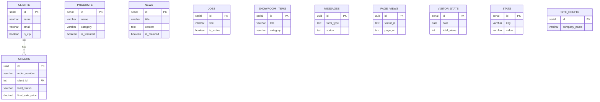

# 📚 Documentation Primavet - Site Web Textile

> Documentation complète du site web Primavet incluant l'espace d'administration, la base de données Supabase, et tous les scripts JavaScript.

---

## 📑 Table des Matières

1. [Vue d'Ensemble](#vue-densemble)
2. [Architecture du Projet](#architecture-du-projet)
3. [Base de Données Supabase](#base-de-données-supabase)
4. [Espace Administrateur](#espace-administrateur)
5. [Scripts JavaScript](#scripts-javascript)
6. [Pages du Site](#pages-du-site)
7. [Sécurité & Politiques RLS](#sécurité--politiques-rls)

---

## 🏗️ Vue d'Ensemble

**Primavet** est un site web professionnel pour une entreprise textile. Le site comprend:

- **Site public** : Présentation de l'entreprise, produits, actualités, showroom, recrutement
- **Espace Administrateur** : Tableau de bord complet avec gestion du contenu, pipeline commercial (CRM), et analytics
- **Backend** : Base de données Supabase avec Row Level Security (RLS)

### Technologies Utilisées

| Technologie | Usage |
|-------------|-------|
| **HTML5** | Structure des pages |
| **CSS3** | Styles (`styles.css`, `admin.css`) |
| **JavaScript Vanilla** | Logique client-side |
| **Supabase** | Backend (BDD PostgreSQL + Auth) |
| **Font Awesome** | Icônes |
| **Google Fonts** | Typographie (Poppins, Open Sans) |
| **Chart.js** | Graphiques (dashboard admin) |
| **Cloudflare Workers** | Déploiement (via Wrangler) |

---

## 📂 Architecture du Projet

```
tarekyahya/
├── index.html              # Page d'accueil
├── about.html              # À propos
├── products.html           # Catalogue produits
├── showroom.html           # Galerie showroom
├── news.html               # Actualités
├── recruitment.html        # Offres d'emploi
├── contact.html            # Contact
├── quote.html              # Demande de devis
├── suggestion.html         # Boîte à suggestions
├── login.html              # Connexion admin
├── espace_admin.html       # Dashboard administrateur
│
├── css/
│   ├── styles.css          # Styles du site public
│   └── admin.css           # Styles de l'espace admin
│
├── js/
│   ├── supabase-client.js  # Configuration Supabase
│   ├── data-service.js     # Service de données (CRUD)
│   ├── admin.js            # Logique dashboard admin
│   ├── form-handler.js     # Gestion des formulaires
│   ├── page-renderers.js   # Rendu dynamique des pages
│   ├── main.js             # Scripts généraux du site
│   └── visitor-tracker.js  # Tracking des visiteurs
│
├── database/
│   └── schema.sql          # Schéma de la base de données
│
├── assets/                 # Images et médias
└── wrangler.jsonc          # Config déploiement Cloudflare
```

---

## 🗄️ Base de Données Supabase

La base de données comprend **11 tables** avec Row Level Security (RLS) activée.

### 📊 Schéma des Tables

---

#### 1. `page_views` - Tracking des Visites

Enregistre chaque page vue par les visiteurs.

| Colonne | Type | Description |
|---------|------|-------------|
| `id` | UUID (PK) | Identifiant unique |
| `visitor_id` | TEXT | ID unique du visiteur |
| `page_url` | TEXT | URL complète de la page |
| `page_path` | TEXT | Chemin de la page |
| `page_title` | TEXT | Titre de la page |
| `referrer` | TEXT | Source de référence |
| `user_agent` | TEXT | Navigateur du visiteur |
| `screen_width` | INT | Largeur d'écran |
| `screen_height` | INT | Hauteur d'écran |
| `language` | TEXT | Langue du navigateur |
| `country` | TEXT | Pays du visiteur |
| `city` | TEXT | Ville du visiteur |
| `is_mobile` | BOOLEAN | Visiteur mobile ? |
| `is_new_visitor` | BOOLEAN | Nouveau visiteur ? |
| `session_id` | TEXT | ID de session |
| `created_at` | TIMESTAMP | Date de création |

---

#### 2. `visitor_stats` - Statistiques Agrégées

Statistiques quotidiennes des visiteurs (agrégées).

| Colonne | Type | Description |
|---------|------|-------------|
| `id` | SERIAL (PK) | Identifiant auto-incrémenté |
| `date` | DATE (UNIQUE) | Date des statistiques |
| `total_views` | INT | Total des pages vues |
| `unique_visitors` | INT | Visiteurs uniques |
| `new_visitors` | INT | Nouveaux visiteurs |
| `returning_visitors` | INT | Visiteurs récurrents |
| `mobile_visitors` | INT | Visiteurs mobiles |
| `desktop_visitors` | INT | Visiteurs desktop |
| `avg_session_duration` | INT | Durée moyenne session (sec) |
| `bounce_rate` | DECIMAL | Taux de rebond (%) |
| `top_pages` | JSONB | Pages les plus visitées |
| `top_referrers` | JSONB | Sources de trafic |
| `updated_at` | TIMESTAMP | Dernière mise à jour |

---

#### 3. `site_config` - Configuration du Site

Configuration générale du site (contact, réseaux sociaux).

| Colonne | Type | Description |
|---------|------|-------------|
| `id` | SERIAL (PK) | Identifiant |
| `company_name` | VARCHAR(100) | Nom de l'entreprise |
| `address` | TEXT | Adresse postale |
| `phone` | VARCHAR(50) | Téléphone |
| `email` | VARCHAR(100) | Email de contact |
| `business_hours` | VARCHAR(100) | Horaires d'ouverture |
| `social_links` | JSONB | Liens réseaux sociaux |
| `updated_at` | TIMESTAMP | Dernière mise à jour |

---

#### 4. `products` - Catalogue Produits

Les produits/collections disponibles.

| Colonne | Type | Description |
|---------|------|-------------|
| `id` | SERIAL (PK) | Identifiant |
| `name` | VARCHAR(200) | Nom du produit |
| `description` | TEXT | Description détaillée |
| `category` | VARCHAR(50) | Catégorie (homme, femme, professionnel, accessoires) |
| `badge` | VARCHAR(50) | Badge (Nouveau, Promo, etc.) |
| `image_url` | TEXT | URL de l'image |
| `icon` | VARCHAR(50) | Icône Font Awesome |
| `gradient` | VARCHAR(100) | Gradient CSS de la carte |
| `is_featured` | BOOLEAN | Produit mis en avant |
| `sort_order` | INT | Ordre d'affichage |
| `created_at` | TIMESTAMP | Date de création |

---

#### 5. `news` - Actualités

Articles d'actualité du site.

| Colonne | Type | Description |
|---------|------|-------------|
| `id` | SERIAL (PK) | Identifiant |
| `title` | VARCHAR(300) | Titre de l'article |
| `content` | TEXT | Contenu complet |
| `excerpt` | TEXT | Résumé court |
| `category` | VARCHAR(50) | Catégorie (Collection, Événement, etc.) |
| `author` | VARCHAR(100) | Auteur |
| `image_url` | TEXT | Image de couverture |
| `icon` | VARCHAR(50) | Icône Font Awesome |
| `gradient` | VARCHAR(100) | Gradient CSS |
| `published_at` | DATE | Date de publication |
| `is_featured` | BOOLEAN | Article mis en avant |

---

#### 6. `jobs` - Offres d'Emploi

Offres de recrutement actives.

| Colonne | Type | Description |
|---------|------|-------------|
| `id` | SERIAL (PK) | Identifiant |
| `title` | VARCHAR(200) | Titre du poste |
| `location` | VARCHAR(100) | Localisation |
| `contract_type` | VARCHAR(50) | Type de contrat (CDI, CDD, Stage) |
| `experience` | VARCHAR(100) | Expérience requise |
| `description` | TEXT | Description du poste |
| `is_active` | BOOLEAN | Offre active |
| `created_at` | TIMESTAMP | Date de création |

---

#### 7. `showroom_items` - Éléments Showroom

Éléments de la galerie showroom.

| Colonne | Type | Description |
|---------|------|-------------|
| `id` | SERIAL (PK) | Identifiant |
| `title` | VARCHAR(200) | Titre |
| `description` | TEXT | Description |
| `category` | VARCHAR(50) | Catégorie (collection, realisation, evenement) |
| `icon` | VARCHAR(50) | Icône Font Awesome |
| `gradient` | VARCHAR(100) | Gradient CSS |
| `sort_order` | INT | Ordre d'affichage |

---

#### 8. `stats` - Statistiques du Site

Statistiques affichées sur le site (chiffres clés).

| Colonne | Type | Description |
|---------|------|-------------|
| `id` | SERIAL (PK) | Identifiant |
| `key` | VARCHAR(50) | Clé unique (ex: `total_clients`) |
| `value` | VARCHAR(100) | Valeur affichée |
| `label` | VARCHAR(100) | Libellé |
| `icon` | VARCHAR(50) | Icône Font Awesome |
| `trend` | VARCHAR(20) | Tendance (ex: +12%) |
| `trend_direction` | VARCHAR(10) | Direction (up/down) |
| `section` | VARCHAR(50) | Section (activity, commercial, about) |
| `sort_order` | INT | Ordre d'affichage |

---

#### 9. `clients` - Base Clients

Informations sur les clients (accès admin uniquement).

| Colonne | Type | Description |
|---------|------|-------------|
| `id` | SERIAL (PK) | Identifiant |
| `name` | VARCHAR(200) | Nom du client |
| `email` | VARCHAR(200) | Email |
| `phone` | VARCHAR(50) | Téléphone |
| `order_count` | INT | Nombre de commandes |
| `status` | VARCHAR(20) | Statut (active, inactive) |
| `is_vip` | BOOLEAN | Client VIP |
| `created_at` | TIMESTAMP | Date de création |

---

#### 10. `orders` - Leads / Pipeline Commercial

Système de gestion des leads (CRM).

| Colonne | Type | Description |
|---------|------|-------------|
| `id` | UUID (PK) | Identifiant unique |
| `order_number` | VARCHAR(50) | Numéro de commande unique |
| `client_id` | INT (FK) | Référence au client |
| `client_name` | VARCHAR(200) | Nom du client |
| `client_email` | VARCHAR(200) | Email du client |
| `client_phone` | VARCHAR(50) | Téléphone |
| `client_company` | VARCHAR(200) | Entreprise |
| `product_interest` | TEXT | Produits d'intérêt |
| `quantity` | INT | Quantité estimée |
| `message` | TEXT | Message du client |
| `lead_status` | VARCHAR(50) | **Statut du lead** : `new`, `contacted`, `negotiating`, `won`, `lost` |
| `lead_tags` | TEXT[] | Tags : `['vip', 'wholesale', 'urgent']` |
| `final_sale_price` | DECIMAL(10,3) | Prix final de vente (TND) |
| `sale_notes` | TEXT | Notes sur la vente |
| `salesperson` | VARCHAR(100) | Commercial responsable |
| `closed_at` | TIMESTAMP | Date de clôture |
| `status` | VARCHAR(50) | Statut legacy (pending, confirmed, etc.) |
| `total_amount` | DECIMAL(10,2) | Montant total |
| `created_at` | TIMESTAMP | Date de création |
| `updated_at` | TIMESTAMP | Dernière mise à jour |

**Index créés :**
- `idx_orders_lead_status` sur `lead_status`
- `idx_orders_created_at` sur `created_at DESC`
- `idx_orders_closed_at` sur `closed_at DESC`

---

#### 11. `messages` - Messages / Formulaires

Tous les messages des formulaires publics.

| Colonne | Type | Description |
|---------|------|-------------|
| `id` | UUID (PK) | Identifiant unique |
| `created_at` | TIMESTAMP | Date de réception |
| `form_type` | TEXT | Type : `contact`, `quote`, `application`, `suggestion` |
| `name` | TEXT | Nom de l'expéditeur |
| `email` | TEXT | Email |
| `phone` | TEXT | Téléphone |
| `company` | TEXT | Entreprise |
| `subject` | TEXT | Sujet |
| `message` | TEXT | Contenu du message |
| `job_id` | TEXT | ID de l'offre (pour candidatures) |
| `product_interest` | TEXT | Produit d'intérêt (pour devis) |
| `quantity` | TEXT | Quantité (pour devis) |
| `status` | TEXT | Statut : `unread`, `read`, `replied`, `archived` |
| `metadata` | JSONB | Données additionnelles |

---

### 📈 Diagramme Entité-Relation



---

## 🔐 Espace Administrateur

L'espace administrateur (`espace_admin.html`) est un dashboard complet pour gérer le site.

### 🧭 Navigation (Sidebar)

| Section | Description |
|---------|-------------|
| **Tableau de Bord** | Vue d'ensemble avec KPIs et statistiques |
| **Actualités** | CRUD des articles d'actualité |
| **Offres d'Emploi** | CRUD des offres de recrutement |
| **Collections** | CRUD des produits |
| **Showroom** | CRUD des éléments du showroom |
| **Pipeline (Kanban)** | CRM visuel pour gérer les leads |
| **Registre des Ventes** | Historique des ventes conclues |
| **Messages** | Lecture des messages (contact, devis, candidatures) |

---

### 📊 Dashboard - Métriques Affichées

#### Section 1 : Pipeline Commercial
- 🆕 **Nouveaux Leads** - Leads de la semaine
- 📞 **Taux de Réponse** - % de leads contactés
- ⏳ **En Négociation** - Deals en cours
- ✅ **Taux de Conversion** - Leads → Ventes

#### Section 2 : Ventes Enregistrées
- 💰 **Chiffre d'affaires total** (TND)
- 📊 **Panier moyen** par vente
- 📅 **Ventes ce mois**

#### Section 3 : Produits Demandés
- ⭐ **Top Demandes** - Produits les plus demandés
- 🏷️ **Tags Clients** (VIP, Grossiste, Particulier)
- ✅ **Dernières Ventes**

#### Section 4 : Quick Stats
- 📰 Nombre d'actualités
- 💼 Nombre d'offres d'emploi
- 📧 Nombre de messages
- 📋 Total des leads

#### Section 5 : Activité Générale
- 👁️ Total visiteurs
- 📄 Total pages vues
- 🛒 Total commandes
- 📈 Taux de conversion visiteurs → clients

#### Section 6 : Statistiques Visiteurs Détaillées
- Total visiteurs
- Visiteurs aujourd'hui
- Nouveaux visiteurs
- Sessions
- Pages vues
- Pages par session

---

### 📋 Pipeline Commercial (Kanban)

Le système CRM utilise un tableau Kanban avec 5 colonnes :

| Colonne | Statut | Couleur |
|---------|--------|---------|
| 🆕 Nouveaux | `new` | Bleu |
| 📞 Contactés | `contacted` | Cyan |
| ⏳ En Négociation | `negotiating` | Orange |
| ✅ Gagnés | `won` | Vert |
| ❌ Perdus | `lost` | Rouge |

**Fonctionnalités :**
- Drag & Drop entre colonnes
- Modal de détail du lead
- Boutons d'action rapide (WhatsApp, Email, Téléphone)
- Export CSV
- Filtrage par tag (VIP, Grossiste, Cette semaine)

---

### 🏆 Win Wizard

Quand un lead passe à "Gagné", un assistant de vente s'ouvre pour enregistrer :
- Montant final convenu (TND)
- Vendeur/Commercial
- Notes (livraison, paiement)

---

### 📝 Gestion du Contenu

Chaque section (News, Jobs, Products, Showroom) dispose de :

| Fonctionnalité | Description |
|----------------|-------------|
| **Liste** | Tableau avec toutes les entrées |
| **Créer** | Formulaire de création |
| **Éditer** | Modification des entrées existantes |
| **Supprimer** | Suppression avec confirmation |
| **Toggle** (Jobs) | Activer/désactiver une offre |

---

### 📬 Gestion des Messages

Filtres disponibles :
- Tous les messages
- Non lus
- Contact
- Devis
- Candidatures
- Suggestions

**Actions :**
- Marquer comme lu
- Afficher les détails
- Supprimer

---

## 📜 Scripts JavaScript

### 1. `supabase-client.js` - Configuration Supabase

**Rôle :** Initialise le client Supabase et gère l'authentification.

#### Objets Exportés

| Objet | Description |
|-------|-------------|
| `supabaseClient` | Instance du client Supabase |
| `supabaseReady` | Promise résolu quand Supabase est prêt |
| `AuthManager` | Gestionnaire d'authentification |
| `RateLimiter` | Limiteur de requêtes côté client |

#### `AuthManager` - Méthodes

| Méthode | Description |
|---------|-------------|
| `getSession()` | Récupère la session courante |
| `isAuthenticated()` | Vérifie si l'utilisateur est connecté |
| `isAdmin()` | Vérifie si l'utilisateur est admin |
| `signIn(email, password)` | Connexion par email/mot de passe |
| `signOut()` | Déconnexion |
| `onAuthStateChange(callback)` | Écoute les changements d'état d'auth |

#### `RateLimiter` - Méthodes

| Méthode | Description |
|---------|-------------|
| `canMakeRequest(key)` | Vérifie si une requête peut être faite (100 req/min) |

---

### 2. `data-service.js` - Service de Données

**Rôle :** Couche d'abstraction pour toutes les opérations CRUD avec Supabase.

#### Configuration

```javascript
cache: {}              // Cache des données
cacheExpiry: 300000   // 5 minutes
```

#### Méthodes - Site Config

| Méthode | Description |
|---------|-------------|
| `getSiteConfig()` | Récupère la configuration du site |
| `getDefaultSiteConfig()` | Configuration par défaut |

#### Méthodes - Products

| Méthode | Description |
|---------|-------------|
| `getProducts(category)` | Liste des produits (optionnel: par catégorie) |
| `getProductsPaginated(page, perPage, category, searchTerm)` | Produits avec pagination |
| `getFeaturedProducts(limit)` | Produits mis en avant |
| `createProduct(productData)` | Créer un produit |
| `updateProduct(id, productData)` | Modifier un produit |
| `deleteProduct(id)` | Supprimer un produit |

#### Méthodes - News

| Méthode | Description |
|---------|-------------|
| `getNews(limit)` | Liste des actualités |
| `getNewsPaginated(page, perPage, searchTerm)` | News avec pagination |
| `getFeaturedNews(limit)` | News mises en avant |
| `createNews(newsData)` | Créer une actualité |
| `updateNews(id, newsData)` | Modifier une actualité |
| `deleteNews(id)` | Supprimer une actualité |

#### Méthodes - Jobs

| Méthode | Description |
|---------|-------------|
| `getJobs()` | Offres actives |
| `getAllJobs()` | Toutes les offres (admin) |
| `getJobsCount()` | Nombre d'offres |
| `createJob(jobData)` | Créer une offre |
| `updateJob(id, jobData)` | Modifier une offre |
| `deleteJob(id)` | Supprimer une offre |
| `toggleJobActive(id, isActive)` | Toggle statut actif |

#### Méthodes - Showroom

| Méthode | Description |
|---------|-------------|
| `getShowroomItems(category)` | Éléments du showroom |
| `createShowroomItem(itemData)` | Créer un élément |
| `updateShowroomItem(id, itemData)` | Modifier un élément |
| `deleteShowroomItem(id)` | Supprimer un élément |

#### Méthodes - Stats

| Méthode | Description |
|---------|-------------|
| `getStats(section)` | Statistiques par section |
| `getStat(key)` | Une statistique par clé |

#### Méthodes - Clients

| Méthode | Description |
|---------|-------------|
| `getClients()` | Liste des clients |
| `getTopClients(limit)` | Top clients par commandes |
| `getClientStats()` | Statistiques clients |

#### Méthodes - Messages

| Méthode | Description |
|---------|-------------|
| `getMessages(filter)` | Messages avec filtre optionnel |
| `getMessage(id)` | Détails d'un message |
| `markMessageAsRead(id)` | Marquer comme lu |
| `deleteMessage(id)` | Supprimer un message |

#### Méthodes - Visitor Tracking

| Méthode | Description |
|---------|-------------|
| `getDetailedVisitorStats()` | Statistiques détaillées des visiteurs |
| `getVisitorStats()` | Statistiques pour le dashboard |
| `getTopPages(limit)` | Pages les plus visitées |
| `getViewsByDay(days)` | Vues par jour (graphique) |
| `getTopReferrers(limit)` | Sources de trafic |
| `getDeviceStats()` | Stats mobile vs desktop |

#### Méthodes - Orders/CRM

| Méthode | Description |
|---------|-------------|
| `getOrderStats()` | Statistiques des commandes/leads |

#### Utilitaires

| Méthode | Description |
|---------|-------------|
| `getCached(key, fetchFn)` | Données en cache ou fetch |
| `clearCache()` | Vider le cache |

---

### 3. `admin.js` - Logique Dashboard Admin

**Rôle :** Gère toute la logique de l'espace administrateur.

#### État Global

```javascript
currentUser = null      // Utilisateur connecté
deleteNewsId = null     // ID de l'article à supprimer
deleteJobId = null      // ID de l'offre à supprimer
deleteProductId = null  // ID du produit à supprimer
deleteShowroomId = null // ID de l'élément à supprimer
deleteMessageId = null  // ID du message à supprimer
deleteOrderId = null    // ID de la commande à supprimer
deleteType = null       // Type d'élément à supprimer
currentLeadId = null    // Lead actuellement sélectionné
allLeads = []           // Tous les leads chargés
```

#### Fonctions - Authentification

| Fonction | Description |
|----------|-------------|
| `checkAuth()` | Vérifie l'authentification |
| `validateCsrf()` | Valide le token CSRF |
| `rateLimitedRequest(requestFn, key)` | Requête avec rate limiting |

#### Fonctions - Navigation

| Fonction | Description |
|----------|-------------|
| `initNavigation()` | Initialise les liens de navigation |
| `switchSection(sectionName)` | Change de section |
| `switchSubtab(section, tab)` | Change de sous-onglet |

#### Fonctions - Notifications

| Fonction | Description |
|----------|-------------|
| `showToast(message, type)` | Affiche une notification toast |

#### Fonctions - News CRUD

| Fonction | Description |
|----------|-------------|
| `loadNewsTable()` | Charge la liste des actualités |
| `openNewsModal(newsData)` | Ouvre le formulaire d'édition |
| `closeNewsModal()` | Ferme le formulaire |
| `editNews(id)` | Charge les données pour édition |
| `confirmDeleteNews(id)` | Demande confirmation de suppression |
| `deleteNews(id)` | Supprime l'actualité |
| `handleNewsFormSubmit(e)` | Soumission du formulaire |

#### Fonctions - Jobs CRUD

| Fonction | Description |
|----------|-------------|
| `loadJobsTable()` | Charge la liste des offres |
| `openJobModal(jobData)` | Ouvre le formulaire d'édition |
| `closeJobModal()` | Ferme le formulaire |
| `editJob(id)` | Charge les données pour édition |
| `toggleJob(id, isActive)` | Toggle statut actif |
| `confirmDeleteJob(id)` | Demande confirmation |
| `deleteJob(id)` | Supprime l'offre |
| `handleJobFormSubmit(e)` | Soumission du formulaire |

#### Fonctions - Products CRUD

| Fonction | Description |
|----------|-------------|
| `loadProductsTable()` | Charge la liste des produits |
| `openProductModal(productData)` | Ouvre le formulaire |
| `closeProductModal()` | Ferme le formulaire |
| `editProduct(id)` | Charge pour édition |
| `confirmDeleteProduct(id)` | Demande confirmation |
| `deleteProduct(id)` | Supprime le produit |
| `handleProductFormSubmit(e)` | Soumission du formulaire |

#### Fonctions - Showroom CRUD

| Fonction | Description |
|----------|-------------|
| `loadShowroomTable()` | Charge la liste |
| `openShowroomModal(itemData)` | Ouvre le formulaire |
| `closeShowroomModal()` | Ferme le formulaire |
| `editShowroom(id)` | Charge pour édition |
| `confirmDeleteShowroom(id)` | Demande confirmation |
| `deleteShowroom(id)` | Supprime l'élément |
| `handleShowroomFormSubmit(e)` | Soumission du formulaire |

#### Fonctions - Messages

| Fonction | Description |
|----------|-------------|
| `loadMessagesTable()` | Charge la liste des messages |
| `viewMessage(id)` | Affiche les détails |
| `closeMessageModal()` | Ferme la modal |
| `confirmDeleteMessage(id)` | Demande confirmation |
| `deleteMessage(id)` | Supprime le message |

#### Fonctions - Pipeline (CRM)

| Fonction | Description |
|----------|-------------|
| `loadPipeline()` | Charge le tableau Kanban |
| `renderKanbanColumn(status, leads)` | Affiche une colonne |
| `initKanbanDragDrop()` | Initialise le drag & drop |
| `viewLead(id)` | Affiche les détails du lead |
| `closeLeadModal()` | Ferme la modal |
| `changeLeadStatus(newStatus)` | Change le statut du lead |
| `updateLeadStatus(leadId, newStatus)` | Met à jour en BDD |

#### Fonctions - Win Wizard

| Fonction | Description |
|----------|-------------|
| `openWinWizard(lead)` | Ouvre l'assistant de vente |
| `closeWinWizard()` | Ferme l'assistant |
| `handleWinWizardSubmit(e)` | Enregistre la vente |

#### Fonctions - Export

| Fonction | Description |
|----------|-------------|
| `exportOrdersToCSV()` | Exporte les commandes en CSV |
| `exportSalesLedgerToCSV()` | Exporte le registre des ventes |
| `exportPipelineToCSV()` | Exporte le pipeline |

#### Fonctions - Dashboard Stats

| Fonction | Description |
|----------|-------------|
| `loadDashboardStats()` | Charge toutes les statistiques |
| `loadPipelineStats()` | Charge les stats du pipeline |
| `loadTopRequestedProducts()` | Charge les produits demandés |
| `loadRecentWins()` | Charge les dernières ventes |

#### Utilitaires

| Fonction | Description |
|----------|-------------|
| `formatDate(dateStr)` | Formate une date |
| `formatNumber(num)` | Formate un nombre |
| `sanitizeInput(str)` | Nettoie les entrées utilisateur |
| `escapeHtml(str)` | Échappe le HTML (anti-XSS) |
| `openWhatsApp(phone)` | Ouvre WhatsApp |
| `handleConfirmDelete()` | Gère la suppression confirmée |
| `debugLog(operation, data)` | Log de débogage |

---

### 4. `form-handler.js` - Gestion des Formulaires

**Rôle :** Gère les soumissions de formulaires publics vers Supabase.

#### Configuration

```javascript
config: {
    maxFileSize: 5 * 1024 * 1024,  // 5MB
    allowedFileTypes: {
        cv: ['application/pdf', 'application/msword', '...'],
        image: ['image/jpeg', 'image/png', 'image/webp']
    },
    honeypotFieldName: 'website_url',  // Détection de bots
    submissionCooldown: 10000          // 10 sec entre soumissions
}
```

#### Méthodes Principales

| Méthode | Description |
|---------|-------------|
| `init()` | Initialise tous les gestionnaires |
| `addHoneypotFields()` | Ajoute des champs anti-bot |
| `isBot(form)` | Détecte les soumissions de bots |
| `canSubmit(formId)` | Vérifie le cooldown |

#### Méthodes de Validation

| Méthode | Description |
|---------|-------------|
| `sanitizeInput(str)` | Nettoie les entrées |
| `isValidEmail(email)` | Valide le format email |
| `isValidPhone(phone)` | Valide le format téléphone |
| `validateFile(file, type)` | Valide les fichiers uploadés |
| `parseQuantityEstimate(qty)` | Parse les quantités ("11-50" → 30) |

#### Gestionnaires de Formulaires

| Méthode | Description |
|---------|-------------|
| `initContactForm()` | Formulaire de contact |
| `initQuoteForm()` | Formulaire de demande de devis |
| `initApplicationForm()` | Formulaire de candidature |
| `initSuggestionForm()` | Formulaire de suggestion |
| `handleFormSubmit(form, formType)` | Soumission générique |
| `handleApplicationSubmit(form)` | Soumission candidature (avec CV) |
| `handleSuggestionSubmit(form)` | Soumission suggestion (avec image) |

#### Upload & Utilitaires

| Méthode | Description |
|---------|-------------|
| `uploadFile(file, bucket)` | Upload vers Supabase Storage |
| `collectFormData(formData, formType)` | Collecte les données du formulaire |
| `getSuccessMessage(formType)` | Message de succès par type |
| `showSuccess(form, message)` | Affiche le message de succès |
| `showError(form, message)` | Affiche le message d'erreur |

---

### 5. `page-renderers.js` - Rendu Dynamique

**Rôle :** Fonctions pour afficher le contenu dynamique sur chaque page.

#### Objet Sanitizer (Anti-XSS)

| Méthode | Description |
|---------|-------------|
| `escapeHtml(str)` | Échappe les caractères HTML |
| `sanitizeUrl(url)` | Valide les URLs (bloque javascript:) |
| `sanitizeGradient(gradient)` | Valide les gradients CSS |
| `sanitizeIcon(icon)` | Valide les classes Font Awesome |

#### Renderers - Products

| Méthode | Description |
|---------|-------------|
| `renderProducts(containerId, category)` | Affiche les produits |
| `renderProductsPaginated(containerId, paginationId)` | Avec pagination |
| `searchProducts(searchTerm)` | Recherche de produits |
| `filterProductsByCategory(category)` | Filtre par catégorie |
| `goToProductsPage(page)` | Change de page |
| `renderFeaturedProducts(containerId)` | Produits en vedette |
| `initProductFilters()` | Initialise les filtres |

#### Renderers - News

| Méthode | Description |
|---------|-------------|
| `renderNews(containerId, paginationId)` | Affiche les actualités |
| `searchNews(searchTerm)` | Recherche d'actualités |
| `goToNewsPage(page)` | Change de page |
| `renderFeaturedNews(containerId)` | News en vedette |

#### Renderers - Jobs

| Méthode | Description |
|---------|-------------|
| `renderJobs(containerId)` | Affiche les offres d'emploi |

#### Renderers - Showroom

| Méthode | Description |
|---------|-------------|
| `renderShowroom(containerId, category)` | Affiche le showroom |
| `initShowroomFilters()` | Initialise les filtres |

#### Renderers - Stats & Footer

| Méthode | Description |
|---------|-------------|
| `renderAboutStats(containerId)` | Stats de la page About |
| `renderFooterContact()` | Infos de contact du footer |

#### Utilitaires

| Méthode | Description |
|---------|-------------|
| `capitalizeFirst(str)` | Première lettre en majuscule |
| `formatDate(dateStr)` | Formate une date en français |
| `formatCurrency(amount)` | Formate un montant (€) |
| `renderPagination(containerId, result, type)` | Affiche la pagination |

---

### 6. `main.js` - Scripts Généraux

**Rôle :** Fonctionnalités générales du site public.

#### Initialisation

```javascript
document.addEventListener('DOMContentLoaded', function() {
    initNavigation();
    initSlider();
    initFormValidation();
    initScrollAnimations();
    initModal();
    initProductFilter();
    initFileUpload();
    initAccessibility();
});
```

#### Modules

| Module | Description |
|--------|-------------|
| `initAccessibility()` | Liens skip, focus management |
| `initNavigation()` | Menu hamburger, scroll sticky |
| `initSlider()` | Slider hero avec autoplay |
| `initFormValidation()` | Validation des formulaires |
| `initScrollAnimations()` | Animations au scroll |
| `initModal()` | Modales génériques |
| `initProductFilter()` | Filtres de produits |
| `initFileUpload()` | Prévisualisation des fichiers |

#### Fonctions Utilitaires

| Fonction | Description |
|----------|-------------|
| `debounce(func, wait)` | Debounce pour performance |
| `throttle(func, limit)` | Throttle pour scroll events |
| `formatPhoneNumber(input)` | Formate les numéros de téléphone |
| `animateCounter(element, target, duration)` | Animation de compteur |

---

### 7. `visitor-tracker.js` - Tracking Visiteurs

**Rôle :** Enregistre les visites de pages dans Supabase.

#### Configuration

```javascript
config: {
    storageKey: 'primavet_visitor_id',
    sessionKey: 'primavet_session_id',
    sessionTimeout: 1800000,  // 30 minutes
    trackingEnabled: true
}
```

#### Méthodes

| Méthode | Description |
|---------|-------------|
| `init()` | Initialise le tracking |
| `getVisitor()` | Récupère/crée l'ID visiteur |
| `getSessionId()` | Récupère/crée l'ID session |
| `isMobile()` | Détecte les mobiles |
| `collectVisitorData()` | Collecte les données de visite |
| `trackPageView(data)` | Enregistre dans `page_views` |
| `setupActivityTracking()` | Tracking d'activité (click, scroll) |

---

## 🌐 Pages du Site

| Page | URL | Description |
|------|-----|-------------|
| **Accueil** | `index.html` | Hero slider, produits vedettes, news |
| **À Propos** | `about.html` | Présentation de l'entreprise, stats |
| **Produits** | `products.html` | Catalogue avec filtres et pagination |
| **Showroom** | `showroom.html` | Galerie avec filtres |
| **Actualités** | `news.html` | Articles avec pagination |
| **Recrutement** | `recruitment.html` | Offres d'emploi actives |
| **Contact** | `contact.html` | Formulaire de contact |
| **Devis** | `quote.html` | Formulaire de demande de devis |
| **Suggestions** | `suggestion.html` | Formulaire de suggestions |
| **Connexion** | `login.html` | Page de connexion admin |
| **Admin** | `espace_admin.html` | Dashboard administrateur |

---

## 🔒 Sécurité & Politiques RLS

### Fonction Helper `is_admin()`

```sql
CREATE OR REPLACE FUNCTION is_admin()
RETURNS BOOLEAN AS $$
BEGIN
    RETURN (
        auth.uid() IS NOT NULL 
        AND (
            (auth.jwt() -> 'user_metadata' ->> 'role') = 'admin'
            OR (auth.jwt() -> 'app_metadata' ->> 'role') = 'admin'
        )
    );
END;
$$ LANGUAGE plpgsql SECURITY DEFINER;
```

### Politiques RLS par Table

| Table | Lecture Publique | Écriture Admin | Notes |
|-------|------------------|----------------|-------|
| `site_config` | ✅ Tous | ✅ Admin | Config visible, modifiable par admin |
| `products` | ✅ Tous | ✅ Admin | Produits publics |
| `news` | ✅ Tous | ✅ Admin | News publiques |
| `jobs` | ✅ Jobs actifs | ✅ Admin | Seules les offres actives sont visibles publiquement |
| `showroom_items` | ✅ Tous | ✅ Admin | Showroom public |
| `stats` | ✅ Tous | ✅ Admin | Stats publiques |
| `clients` | ❌ | ✅ Admin | Données sensibles (PII) |
| `messages` | ❌ | ✅ Admin (lecture), ✅ Public (insert) | Public peut envoyer, admin peut lire |
| `page_views` | ❌ | ✅ Admin (lecture), ✅ Public (insert) | Tracking anonyme |
| `visitor_stats` | ❌ | ✅ Admin | Stats agrégées |

---

## 📋 Résumé

| Composant | Quantité |
|-----------|----------|
| **Pages HTML** | 11 |
| **Tables Supabase** | 11 |
| **Modules JavaScript** | 7 |
| **Fichiers CSS** | 2 |
| **Fonctions Admin** | ~100+ |
| **Fonctions DataService** | ~40+ |

---

> **Document créé le :** 21 Janvier 2026  
> **Projet :** Primavet - Site Web Textile  
> **Version :** 1.0
